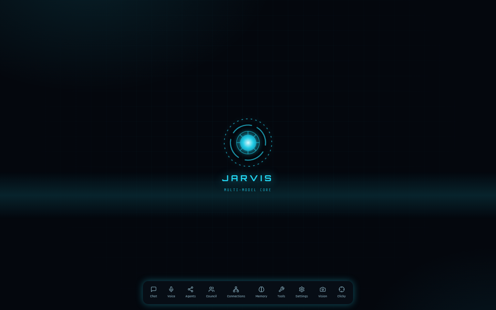
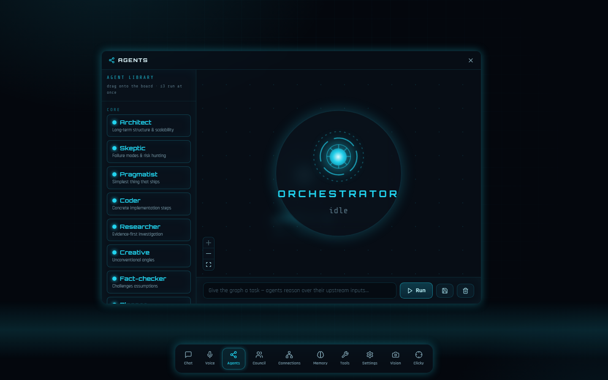
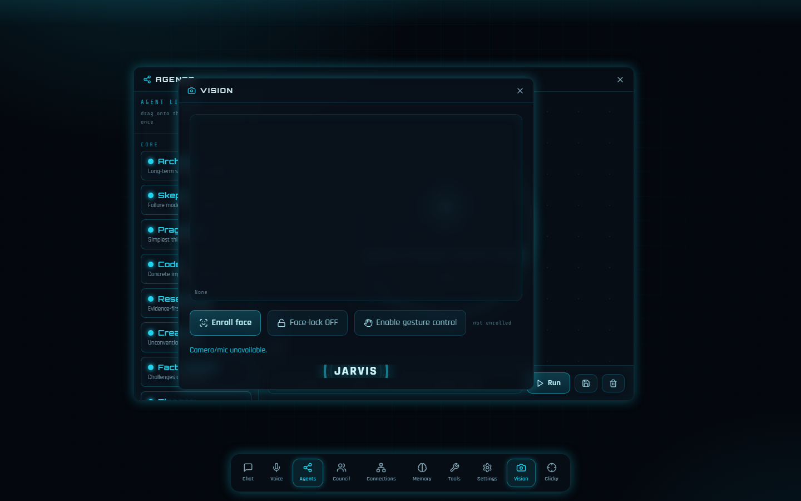
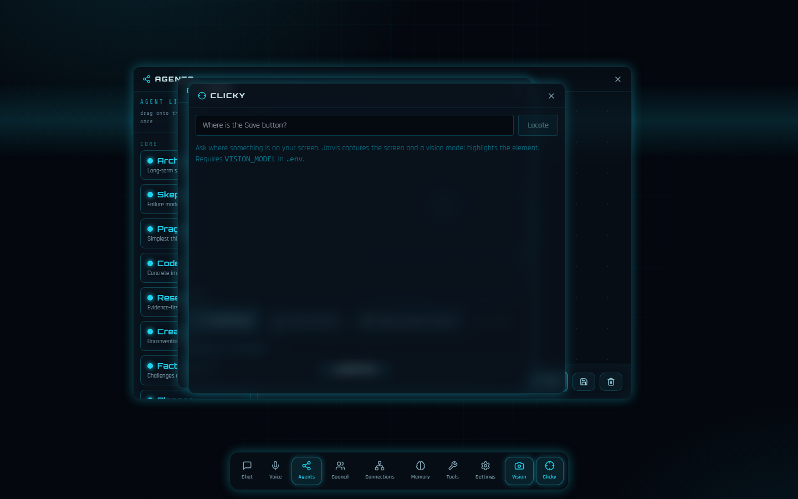

<div align="center">

# 🤖 Jarvis — Agentic Multi-Model Orchestrator

**One "head" that routes every task to the best model, convenes a multi-model planning council for hard problems, reasons across a graph of agents, remembers what matters, calls real tools over MCP, sees your screen, and talks back — all running locally on Windows.**

[](https://www.python.org/)
[](https://fastapi.tiangolo.com/)
[](https://react.dev/)
[](https://github.com/BerriAI/litellm)
[](https://build.nvidia.com/)
[](https://modelcontextprotocol.io/)
[](#-testing)
[](https://github.com/open-jarvis/OpenJarvis)

</div>

---

## ✨ What is this?

Jarvis is a **local agentic orchestrator** built on the [OpenJarvis](https://github.com/open-jarvis/OpenJarvis) backbone. It wires together six proven open-source projects into a single assistant under one strict design principle:

> ### PRIME DIRECTIVE — *wire, don't rewrite.*
> Every capability already exists in a vendored repo. Jarvis **integrates and configures** them through a thin sidecar and the OpenJarvis engine — it does **not** reimplement them. The whole project is built as a chain of self-contained phases, each with its own brainstorm → spec → TDD → gate cycle.

It picks the right model per task, escalates hard planning to a **3-model council**, lets you **draw a graph of agents that reason over each other**, keeps **durable memory**, drops in **MCP tools** (a live code-graph, web/GitHub access, and six ported action tools), supports **always-on voice**, does **face-auth + hand-gesture vision**, and can **point at things on your screen** — behind an ada-style floating-window HUD.

---

## 🎛️ Feature matrix

| | Capability | How |
|---|---|---|
| 🧠 | **Smart routing** | Classifies each task (code / reasoning / general) → best NVIDIA NIM model |
| 🪜 | **Resilient fallback** | `NIM-A → NIM-B → Gemini → local Ollama` with exponential backoff + 429 handling |
| 🏛️ | **Planning council** | 3 distinct models propose in parallel → a reasoning model critiques → synthesizes one plan |
| 🕸️ | **Agent graph** | Draw agent→agent edges; runs in topological order, ≤3 concurrent, 34 ECC personas |
| 💾 | **Memory** | Durable personal facts → `USER.md`, session history, queryable code graph |
| 🔌 | **MCP tools** | Live code knowledge-graph (`:9749`), web/GitHub fetch, + 6 ported action tools |
| 🛠️ | **Action tools** | `web_search`, `weather`, `reminder`, `youtube`, `flight_finder`, `file_processor` |
| 🎙️ | **Voice** | Always-on wake-word ("Hey Jarvis") → Whisper STT → router → Edge-TTS, with barge-in |
| 👁️ | **Vision** | Browser MediaPipe face-auth unlock, hand-gesture window control, mic visualizer |
| 🎯 | **Clicky** | "Where is X on screen?" → vision model points → annotated screenshot |
| 🔑 | **Provider keys** | Paste OpenAI/Anthropic/Groq/… keys in-UI → models appear everywhere (`.env`-backed) |
| 🪟 | **ada-style shell** | Floating, draggable module windows over an arc-reactor HUD; layout persists server-side |

---

## 📸 Screenshots

### The shell — floating module windows over an arc-reactor HUD


<table>
<tr>
<td width="50%"><b>Chat</b> — streamed answers with the served-by model rung<br></td>
<td width="50%"><b>Agents graph</b> — draw agent→agent edges, run in topological order<br></td>
</tr>
<tr>
<td width="50%"><b>Council</b> — 3 live proposals → critique → synthesis<br></td>
<td width="50%"><b>Connections</b> — live code knowledge-graph + routing map<br></td>
</tr>
<tr>
<td width="50%"><b>Memory</b> — durable personal facts + sessions<br></td>
<td width="50%"><b>Tools (MCP)</b> — discover + add MCP servers<br></td>
</tr>
<tr>
<td width="50%"><b>Voice</b> — always-on wake-word assistant<br></td>
<td width="50%"><b>Vision</b> — face-auth, hand gestures, mic visualizer<br></td>
</tr>
<tr>
<td width="50%"><b>Clicky</b> — "where is X?" → on-screen pointing<br></td>
<td width="50%"><b>Settings</b> — switch models live, paste provider keys<br></td>
</tr>
</table>

---

## 🏗️ Architecture

```
                                Browser (React + Vite, ada HUD shell)
   Chat · Agents · Council · Connections · Memory · Tools · Voice · Vision · Clicky · Settings
                                          │  WS + REST
                                          ▼
                       scripts/jarvis_web_api.py   ── thin FastAPI sidecar (:8700) ──
                                          │   zero backbone edits; wires every phase
        ┌───────────────┬────────────────┼─────────────────┬──────────────────┐
        ▼               ▼                 ▼                 ▼                  ▼
  jarvis_router    jarvis_council    jarvis_graph     jarvis_memory      jarvis_vision
  (route+ladder)   (propose/crit/    (topological     (facts→USER.md)    (cosine compare)
        │           synth)            DAG, ≤3)              │             jarvis_clicky
        │               │                 │                │             (grid pointing)
        └───────────────┴───────┬─────────┴────────────────┘             jarvis_voice/wake
                                 ▼                                        jarvis_tools_mcp
                  OpenJarvis LiteLLMEngine  (the ONE LLM path)            (6 action tools)
                                 │
        NIM-A ──▶ NIM-B ──▶ Gemini Flash ──▶ local Ollama   (fallback ladder + backoff)

   MCP servers (config.tools.mcp.servers): codebase-memory (:9749) · agent-reach · jarvis-tools
```

**Design rules enforced throughout:** every LLM call rides `LiteLLMEngine`; no model id is ever hardcoded (all from `.env`); no browser `localStorage` (state persists via sidecar JSON endpoints); council/graph cap at ≤3 concurrent calls; **zero edits to the OpenJarvis backbone or any `_vendor/` repo.**

---

## 🧩 The six wired repos (`_vendor/`, read-only)

| Repo | What Jarvis reuses |
|---|---|
| **[OpenJarvis](https://github.com/open-jarvis/OpenJarvis)** *(backbone)* | LiteLLM engine, agent tool-loop, MCP loader, prompt builder, sessions |
| **codebase-memory-mcp** | Code knowledge-graph + 3D viz UI (`:9749`), as an MCP server |
| **Agent-Reach** | Internet + GitHub access, as an MCP server |
| **superpowers** | The brainstorm → spec → plan → TDD methodology (as skills) |
| **ada_v2** | React web-UI shell, floating windows, visualizer, face-auth |
| **Mark-XL** | Personal-facts memory, STT/TTS, and the six action tools |

---

## 🔬 How it works (phase by phase)

- **Routing & fallback** (`jarvis_router.py`) — keyword-classifies a task, then walks the `NIM-A → NIM-B → Gemini → Ollama` ladder with exponential backoff; `jarvis doctor` reports health.
- **Council** (`jarvis_council.py`) — 3 distinct NIM model families each take a lens (Pragmatist / Architect / Skeptic), propose in parallel, a reasoning model (`enable_thinking`) critiques and synthesizes, a single executor runs the plan. No 429 storm.
- **Agent graph** (`jarvis_graph.py`) — generalizes the council to a user-drawn DAG: validated for cycles (Kahn) with the orchestrator as a mandatory sink, executed with one `asyncio.Task` per node holding a `Semaphore(3)`. 34 personas sourced from real ECC agent definitions.
- **Memory** (`jarvis_memory.py`) — ports Mark-XL's structured facts into `~/.openjarvis/USER.md`, which OpenJarvis's prompt builder injects into every turn — so a fact stored now is recalled later.
- **MCP tools** — `setup_config.py` registers stdio servers into `config.tools.mcp.servers`; the orchestrator's existing tool-loop calls them. Includes the **6 ported action tools** (`jarvis_tools_mcp.py`) — each Mark-XL action with its internal LLM call rewired through the router.
- **Voice** (`jarvis_voice.py` / `jarvis_wake.py`) — openWakeWord → faster-whisper STT → router → Edge-TTS, sentence-streamed, with idle-sleep and barge-in.
- **Vision** (`jarvis_vision.py`) — browser MediaPipe extracts face/hand landmarks; the server owns only a pure-numpy cosine compare and the enrolled vector (presence-only, never returned). Gestures map to window actions.
- **Clicky** (`jarvis_clicky.py`) — two-stage grid (Set-of-Mark) pointing: capture the screen, a vision model picks a grid cell, zoom, pick again, map to pixels, return an annotated screenshot. Vision call rides `LiteLLMEngine` with OpenAI image blocks (model from `.env VISION_MODEL`).
- **Provider keys** (`jarvis_providers.py`) — paste a key in Settings → written to `.env` + live `os.environ` → its models appear in every dropdown. Keys are never echoed back.

---

## 🚀 Getting started (Windows / PowerShell)

```powershell
# Prereqs: git, uv, node, ollama (all on PATH)
uv python install 3.12
uv sync                                   # core deps
ollama pull qwen2.5:7b                    # offline fallback model

# Put your free keys in .env (you own this file):
#   NVIDIA_API_KEY=...     (https://build.nvidia.com — free tier)
#   GEMINI_API_KEY=...     (optional 2nd voice / fallback)
#   VISION_MODEL=meta/llama-3.2-90b-vision-instruct   (optional — enables Clicky)

uv run python scripts/setup_config.py     # generate active config from .env

# CLI
pwsh .\scripts\jarvis.ps1 ask "hi"                       # NIM answer
pwsh .\scripts\jarvis.ps1 ask --agent operative "what's the weather in London"   # tool call

# Web UI (sidecar :8700 + Vite :5173)
pwsh .\scripts\jarvis_web.ps1
```

---

## ✅ Testing

```powershell
uv run pytest tests/web/ -q          # 174/174 — sidecar, router, council, graph,
                                     # memory, voice, vision, action tools, clicky
cd web; npx playwright test          # browser smoke (launcher running)
```

- Unit + integration tests mock all network/LLM/camera — **no live spend, no hardware** required in CI.
- New modules ship at **≥80% coverage**; every phase has one explicit gate.

---

## 🗂️ Project layout

```
scripts/
  jarvis_router.py     routing + fallback ladder + doctor
  jarvis_council.py    propose → critique → synthesize → execute
  jarvis_graph.py      topological agent-graph executor
  jarvis_memory.py     personal facts → USER.md
  jarvis_tools_mcp.py  6 action tools as one MCP server
  jarvis_clicky.py     two-stage grid screen pointing
  jarvis_vision.py     face cosine-compare + lock store
  jarvis_voice.py      STT/TTS · jarvis_wake.py  wake-word + VAD
  jarvis_providers.py  provider keys → .env + live env
  jarvis_web_api.py    the thin FastAPI sidecar wiring it all
  setup_config.py      .env → ~/.openjarvis/config.toml (+ MCP servers)
web/                   React + Vite ada-style shell (floating windows)
src/openjarvis/        the OpenJarvis backbone (vendored, unmodified)
_vendor/               5 read-only reference repos
```

---

## 🧠 Design principles

- **Wire, don't rewrite** — adopt proven implementations; integration over invention.
- **One LLM path** — everything goes through `LiteLLMEngine`; one place for fallback, cost, and tracing.
- **No hardcoded models / no leaked secrets** — model ids and keys live only in `.env`.
- **No backbone/vendor edits** — all new behavior lives in the sidecar + a handful of `scripts/jarvis_*.py` modules.
- **Phase gates** — each feature is shipped behind a brainstorm → spec → TDD → gate cycle.

---

<div align="center">
<sub>Built on <a href="https://github.com/open-jarvis/OpenJarvis">OpenJarvis</a> · NVIDIA NIM · LiteLLM · FastAPI · React · MCP — local-first, Windows.</sub>
</div>
