<div align="center">

# 🤖 Jarvis — Agentic Multi-Model Orchestrator

**One "head" that routes every task to the best model, convenes a multi-model planning council for hard problems, remembers what matters, calls real tools over MCP, and talks back — all running locally on Windows.**

[](https://www.python.org/)
[](https://fastapi.tiangolo.com/)
[](https://react.dev/)
[](https://github.com/BerriAI/litellm)
[](https://build.nvidia.com/)
[](https://modelcontextprotocol.io/)
[](#-testing)

</div>

---

## ✨ What is this?

Jarvis is a **local agentic orchestrator** built on the [OpenJarvis](https://github.com/open-jarvis/OpenJarvis) backbone. It wires together six proven open-source capabilities into a single assistant with one design principle: **integrate and configure — don't reimplement.**

It picks the right model per task, escalates hard planning questions to a **3-model council**, keeps durable memory, drops in **MCP tools** (a live code-graph + web/GitHub access), and supports **always-on voice** — behind a clean 7-tab web UI.

| | |
|---|---|
| 🧠 **Smart routing** | Classifies each task (code / reasoning / general) and routes to the best NVIDIA NIM model |
| 🪜 **Resilient fallback** | `NIM-A → NIM-B → Gemini → local Ollama` with exponential backoff + 429 handling |
| 🏛️ **Planning council** | 3 distinct models propose in parallel → a reasoning model critiques → synthesizes one plan |
| 💾 **Memory** | Durable personal facts, session history, and a queryable code graph |
| 🔌 **MCP tools** | Codebase-Memory graph (`:9749`) + Agent-Reach web/GitHub fetch, dropped in via config |
| 🎙️ **Voice** | Browser mic → wake word → STT → orchestrator → TTS, with barge-in |

---

## 📸 Screenshots

### Chat — streamed answers tagged with the model that served them
> Every reply shows the rung that produced it (`served by NIM-A`).

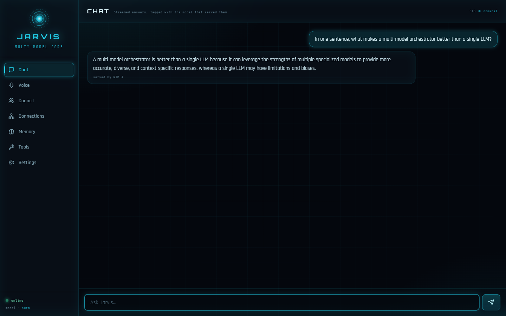

### Council — three models think in parallel, then synthesize
> Pragmatist (Llama-3.3-70B), Architect (Qwen3.5-397B) and Skeptic (DeepSeek-V4) each draft a proposal; a reasoning model critiques and merges them.

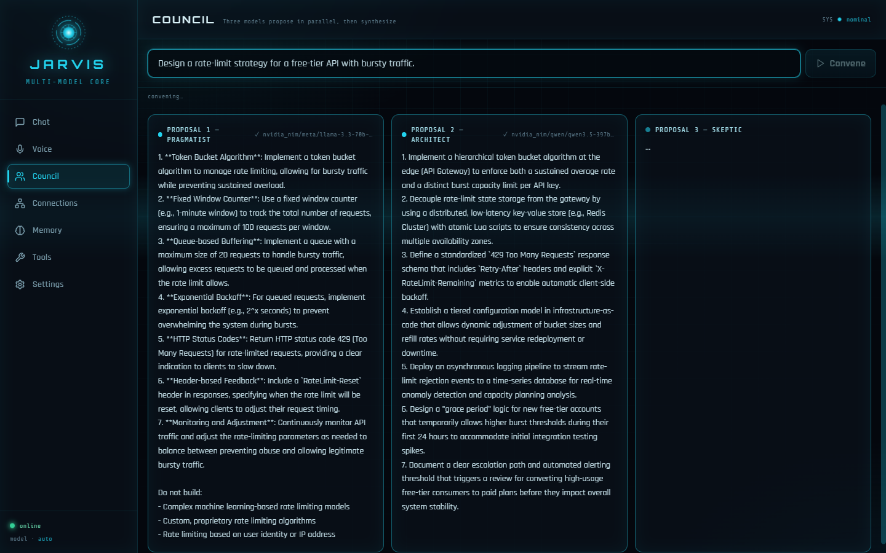

### Connections — live code graph + routing map
> The Codebase-Memory MCP graph (241 nodes / 402 edges of this very repo) alongside the live NIM fallback ladders.

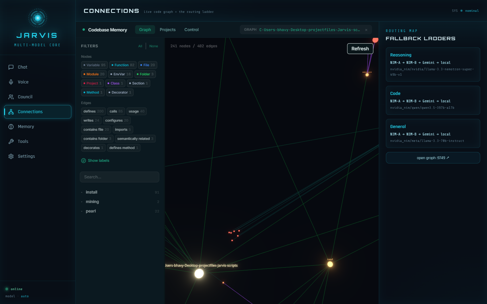

<table>
<tr>
<td width="50%">

**Voice — always-on wake word**

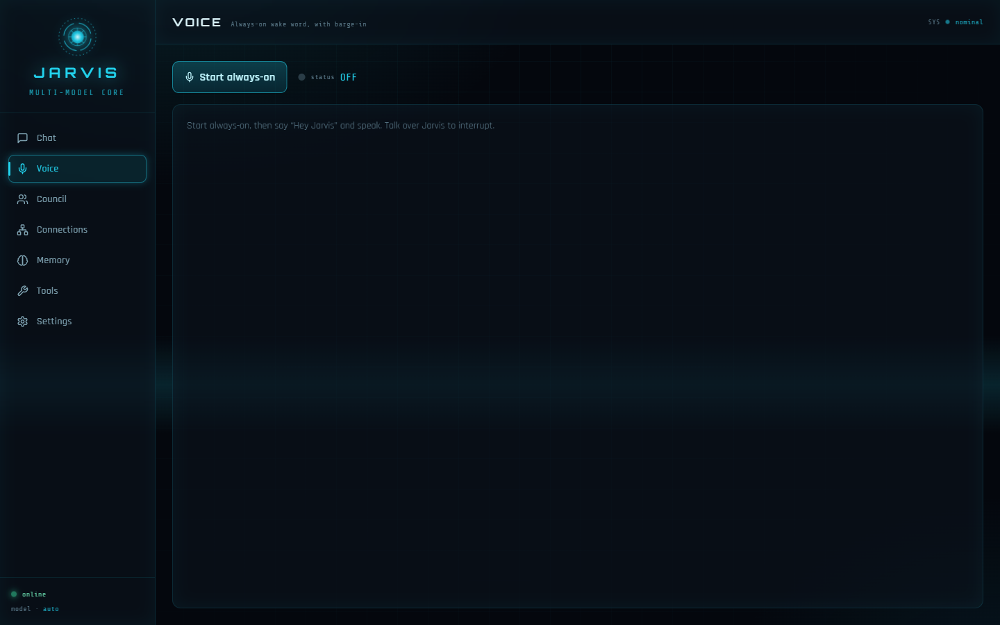

</td>
<td width="50%">

**Memory — durable personal facts**

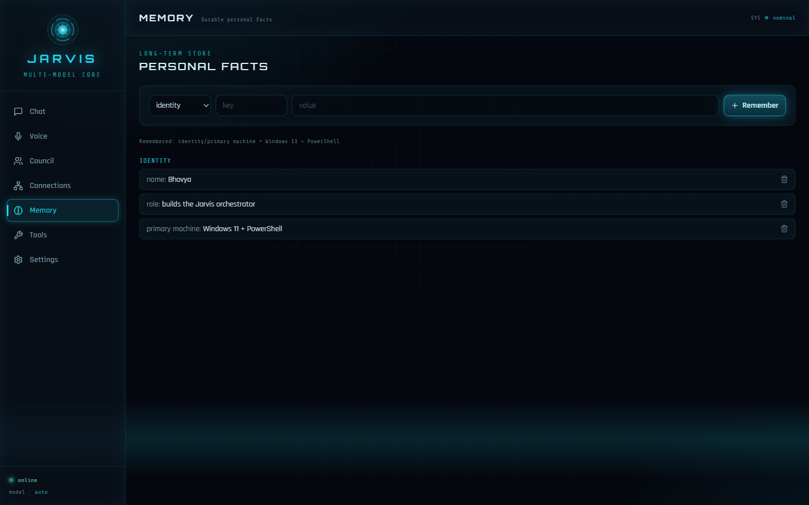

</td>
</tr>
<tr>
<td width="50%">

**Tools — drop-in MCP servers**

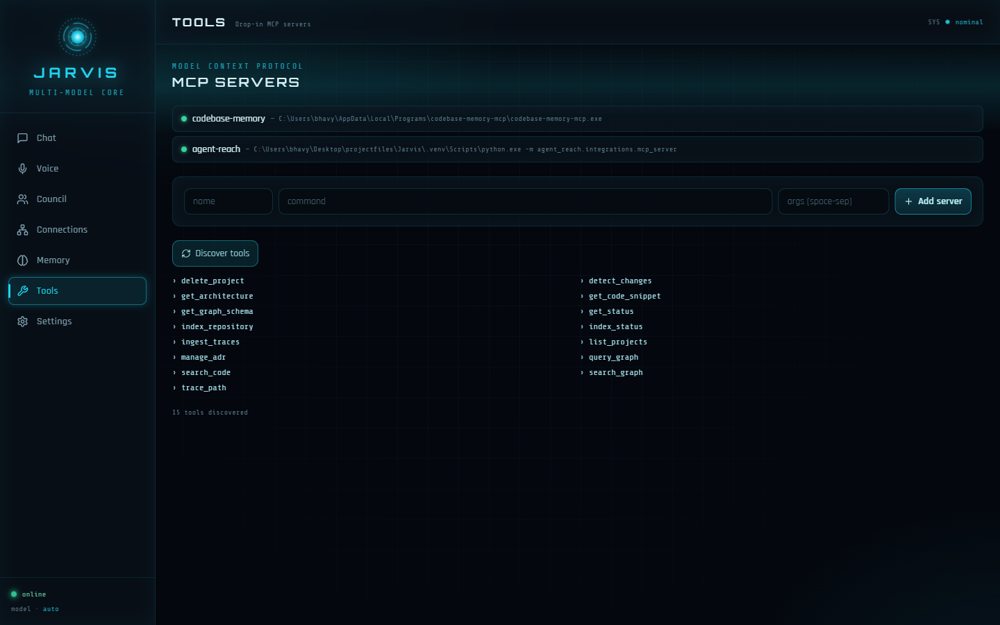

</td>
<td width="50%">

**Settings — switch models without restart**

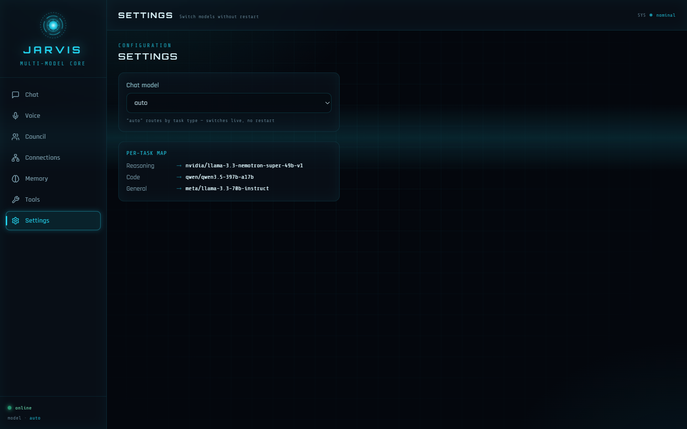

</td>
</tr>
</table>

---

## 🏗️ Architecture

A thin **FastAPI sidecar** (`:8700`) bridges the React web UI to the Jarvis "brain" — every LLM call flows through OpenJarvis's LiteLLM engine, with **zero edits to the backbone or vendored repos**.

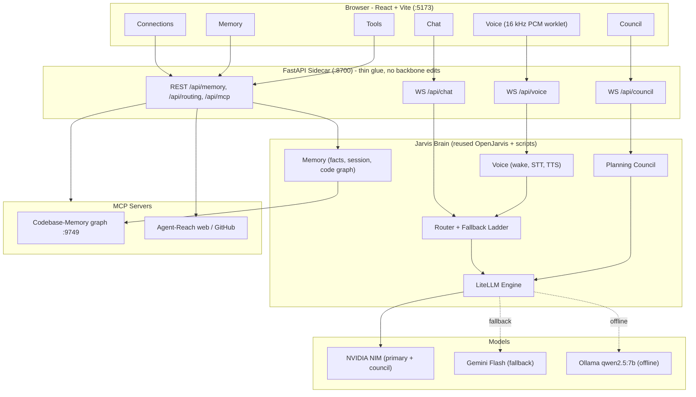

### Request routing & the fallback ladder

Each prompt is classified by keyword heuristics, mapped to a role model, then run through a resilient ladder. A per-rung retry with exponential backoff (`1s → 2s → 4s`) absorbs NIM's free-tier `429`s before walking to the next provider — so a single request degrades gracefully instead of failing.

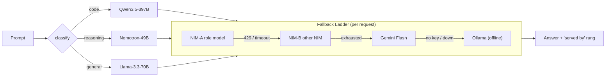

### Planning council (hard problems only)

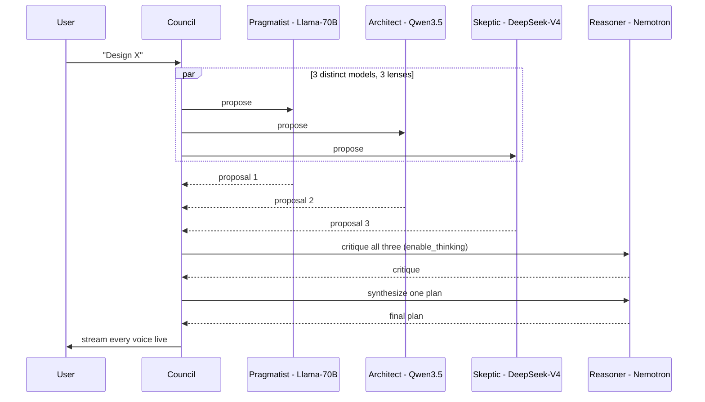

### Voice pipeline (always-on, barge-in)

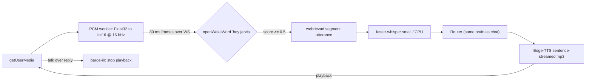

---

## 🧰 Tech stack

**Orchestration & backend:** Python 3.12 · FastAPI · WebSockets · [LiteLLM](https://github.com/BerriAI/litellm) · [OpenJarvis](https://github.com/open-jarvis/OpenJarvis) backbone
**Models:** NVIDIA NIM (Llama-3.3-70B, Qwen3.5-397B, Nemotron-49B, DeepSeek-V4) · Google Gemini Flash · Ollama (qwen2.5:7b)
**Voice:** openWakeWord · faster-whisper · Edge-TTS · webrtcvad · Web Audio `AudioWorklet`
**Tools:** Model Context Protocol — Codebase-Memory MCP (code graph) · Agent-Reach (web/GitHub)
**Frontend:** React · Vite · Tailwind CSS · Framer Motion · lucide-react — an *ada_v2*-inspired "arc-reactor" HUD (Orbitron / Rajdhani / Share Tech Mono)
**Tooling:** `uv` (deps) · `pytest` (24 web tests) · Playwright (browser smoke)

---

## 🚀 Getting started

> Windows + PowerShell. Assumes `git`, [`uv`](https://docs.astral.sh/uv/), `node`, and [`ollama`](https://ollama.com/) are installed.

```powershell
# 1. Install Python deps (core + extras)
uv sync --extra inference-litellm --extra server --extra inference-google --extra inference-cloud

# 2. Voice deps (one-time)
uv pip install faster-whisper edge-tts openwakeword onnxruntime webrtcvad sounddevice "setuptools<81"
uv run python -c "import openwakeword.utils as u; u.download_models()"

# 3. Local fallback model
ollama pull qwen2.5:7b

# 4. Frontend deps
cd web; npm install; cd ..
```

Create a **`.env`** in the project root (never committed — it's gitignored):

```dotenv
NVIDIA_API_KEY=nvapi-...            # free at build.nvidia.com
GEMINI_API_KEY=...                  # optional fallback
NIM_MODEL_REASONING=nvidia/llama-3.3-nemotron-super-49b-v1
NIM_MODEL_CODE=qwen/qwen3.5-397b-a17b
NIM_MODEL_GENERAL=meta/llama-3.3-70b-instruct
NIM_COUNCIL_1=meta/llama-3.3-70b-instruct
NIM_COUNCIL_2=qwen/qwen3.5-397b-a17b
NIM_COUNCIL_3=deepseek-ai/deepseek-v4-pro
NIM_CRITIC=nvidia/llama-3.3-nemotron-super-49b-v1
GEMINI_FALLBACK_MODEL=gemini/gemini-2.0-flash
LOCAL_FALLBACK_MODEL=ollama/qwen2.5:7b
WAKE_MODEL=hey_jarvis
TTS_VOICE=en-US-GuyNeural
```

> ⚠️ NIM model IDs drift monthly. Run `uv run python scripts/verify_models.py` to validate your IDs against the live `/v1/models` catalog.

### Run it

```powershell
# Web UI + voice (sidecar :8700 + Vite :5173)
pwsh .\scripts\jarvis_web.ps1

# (optional) code-graph UI for the Connections tab
codebase-memory-mcp --ui=true --port=9749

# CLI one-shot
pwsh .\scripts\jarvis.ps1 ask "explain async/await in one paragraph"
```

Open **http://localhost:5173** → Chat round-trips through NIM; Voice tab → *Start always-on* → say **"Hey Jarvis"**.

---

## 🧪 Testing

```powershell
uv run pytest tests/web/ -q                       # 24 sidecar / voice / wake tests
cd web; npx playwright test                        # browser render smoke (launcher must be running)
uv run python scripts/jarvis_router.py doctor      # provider health + per-task model map
```

---

## 📁 Project structure

```text
Jarvis/
├── src/openjarvis/             # OpenJarvis backbone (engine, server, memory, MCP loader)
│   ├── engine/litellm.py       #   unified LLM access (every call goes through here)
│   └── server/cloud_router.py  #   + NVIDIA NIM provider (mirrors existing providers)
├── scripts/                    # the Jarvis orchestration layer (this project's work)
│   ├── jarvis_router.py        #   classify -> route -> fallback ladder -> doctor
│   ├── jarvis_council.py       #   propose x3 -> critique -> synthesize -> execute
│   ├── jarvis_memory.py        #   personal facts (-> USER.md), session, code graph
│   ├── jarvis_voice.py         #   STT (faster-whisper) + TTS (Edge-TTS) glue
│   ├── jarvis_wake.py          #   openWakeWord + webrtcvad segmenter
│   ├── jarvis_web_api.py       #   FastAPI sidecar — wires it all to the browser
│   ├── setup_config.py         #   .env -> ~/.openjarvis/config.toml (+ MCP servers)
│   └── verify_*.py             #   gate checks (models, MCP, memory)
├── web/                        # React UI (ada_v2 fork, Electron stripped)
│   ├── src/components/         #   Chat, Voice, Council, Graph, Memory, Tools, Settings
│   └── src/lib/                #   chatSocket, voiceSocket, pcm-worklet
├── tests/web/                  # pytest: sidecar, voice, wake
├── docs/screenshots/           # the images above
└── PROGRESS.md                 # phase-by-phase build log
```

---

## 🛤️ How it was built

Built in **8 gated phases**, each with a concrete acceptance gate before moving on — the full log lives in [`PROGRESS.md`](PROGRESS.md).

| Phase | Capability | Highlight |
|------:|------------|-----------|
| −1 | Bootstrap | OpenJarvis backbone + 5 reference repos, reproducible `uv` env |
| 0 | NIM wiring | Wired NVIDIA NIM via LiteLLM's native provider; caught 3 drifted model IDs |
| 1 | Router + fallback | Task classifier + `NIM→Gemini→local` ladder with 429-aware backoff |
| 2 | MCP drop-in | Code-graph (`:9749`, 31k nodes) + Agent-Reach, via config only |
| 3 | Memory | Durable facts injected into the system prompt; live cross-turn recall |
| 4 | Council | 3 distinct models + reasoning critic/synthesizer, no 429 storm |
| 5 | Web UI | 7-tab React app over a thin sidecar — zero backbone edits |
| 6 | Voice | Browser mic → wake → STT → orchestrator → TTS, with barge-in |

**Design constraints honored throughout:** never hardcode a model ID (all from `.env`), every LLM call through the LiteLLM engine, and never reimplement what a vendored repo already provides.

---

## 🙏 Credits

This project **integrates** (does not fork-and-rewrite) these open-source projects:

- [**OpenJarvis**](https://github.com/open-jarvis/OpenJarvis) — the orchestration backbone ([upstream README](README.openjarvis.md))
- [**codebase-memory-mcp**](https://github.com/DeusData/codebase-memory-mcp) — code graph + 3D viz over MCP
- [**Agent-Reach**](https://github.com/Panniantong/Agent-Reach) — internet + GitHub access
- [**ada_v2**](https://github.com/nazirlouis/ada_v2) — React web UI shell + voice
- [**Mark-XL**](https://github.com/FatihMakes/Mark-XL) — personal-facts memory + local STT/TTS
- [**superpowers**](https://github.com/obra/superpowers) — development methodology

Model access via [NVIDIA NIM](https://build.nvidia.com/), [Google Gemini](https://ai.google.dev/), and [Ollama](https://ollama.com/).

---

<div align="center">
<sub>Built as a personal/prototype-scale agentic orchestrator. Vendored repos are referenced under their own licenses.</sub>
</div>
